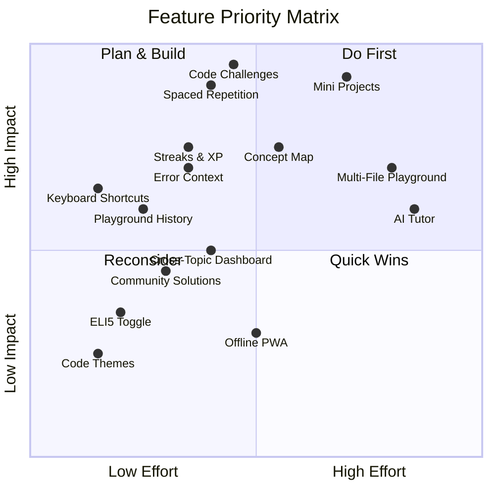

# LearnCraft — Feature Analysis & Strategic Roadmap

> **Analysis based on deep inspection of 100+ source files across the LearnCraft codebase.**

---

## What LearnCraft Already Does Well

Before jumping into recommendations, here's what the codebase already has — and it's genuinely impressive:

| Feature | Implementation Quality | Files |
|---|---|---|
| **Interactive Playground** | Excellent — sandboxed iframe TypeScript runtime, beginner-friendly error messages, 3-pane exercise mode, autocomplete, syntax highlighting | [Playground.tsx](file:///f:/My%20Projects/LearnCraft/components/playground/Playground.tsx), [typescript-runtime.ts](file:///f:/My%20Projects/LearnCraft/components/playground/runtimes/typescript-runtime.ts) |
| **Structured Curriculum** | Very well organized — 32 NestJS lessons across 8 stages, with progression phases, milestones, and estimated times | [nestjs-curriculum.ts](file:///f:/My%20Projects/LearnCraft/app/learn/nestjs/data/nestjs-curriculum.ts) |
| **Note-Taking / Revision** | Rich — highlight text → add notes → Markdown formatting → flashcard mode → export/import → multi-tab sync | [revision-context.tsx](file:///f:/My%20Projects/LearnCraft/context/revision-context.tsx), [revision-storage.ts](file:///f:/My%20Projects/LearnCraft/lib/revision-storage.ts) |
| **Progress Tracking** | Solid — lesson completion, stage milestones, goal-based paths, next-lesson recommendations | [progress-store.ts](file:///f:/My%20Projects/LearnCraft/app/learn/nestjs/data/progress-store.ts) |
| **Lesson Pedagogy** | High quality — analogy boxes, mistake boxes, predict-output exercises, quick checks, info callouts | [methods-section.tsx](file:///f:/My%20Projects/LearnCraft/app/learn/nestjs/nj02-oop-foundations/components/methods-section.tsx) |
| **Reading Controls** | Accessibility-focused — font size, line spacing, dyslexia font, high contrast, focus mode | [reading-control-panel.tsx](file:///f:/My%20Projects/LearnCraft/components/reading-control-panel.tsx) |
| **Design System** | Comprehensive token-based system with semantic colors | [globals.css](file:///f:/My%20Projects/LearnCraft/app/globals.css), [tailwind.config.ts](file:///f:/My%20Projects/LearnCraft/tailwind.config.ts) |

Your ideal flow is: **Learn → Understand → Practice → Run Code → Make Mistakes → Get Feedback → Take Notes → Build Projects → Track Mastery**

You currently cover **Learn ✅ → Understand ✅ → Practice ✅ → Run Code ✅ → Make Mistakes ✅ → Get Feedback (partial) → Take Notes ✅ → Build Projects ❌ → Track Mastery (partial)**

The gaps are in: **richer feedback**, **guided projects**, and **deeper mastery tracking**. Let's fix those.

---

## 🔴 MUST HAVE — Critical Missing Features

These are the features that, without them, LearnCraft feels incomplete for your stated learning flow.

---

### 1. End-of-Lesson Assessment: Code Challenges

**Priority:** 🔴 Must Have  
**Problem it solves:** Users currently complete lessons by reading and clicking "Mark Complete." There's no way to verify they actually *understood* the material. The `QuickCheck` component only reveals answers—it doesn't require the user to produce them.

**What to build:**

Each lesson should end with **2-3 graded code challenges** (before the "Mark Complete" button), using your existing `PlaygroundExercise` system with test cases:

```
Lesson Content → Quick Checks (understanding) → Code Challenges (prove it) → Mark Complete
```

- Challenges use the existing `Playground` exercise mode (starter code, tests, hints, solution)
- Must pass **all visible tests** before "Mark Complete" becomes available
- Track per-lesson challenge completion in [progress-store.ts](file:///f:/My%20Projects/LearnCraft/app/learn/nestjs/data/progress-store.ts)
- Show a score badge (e.g., "3/3 challenges passed ✅")

**Why users need it:** Without this, progress is a lie. Users can "complete" 32 lessons without writing a single line of code on their own. Assessment gates make completion *meaningful*.

**Impact on your flow:** `Practice → Run Code → Make Mistakes → Get Feedback` — this closes the entire feedback loop.

---

### 2. Spaced Repetition for Mastery

**Priority:** 🔴 Must Have  
**Problem it solves:** Users learn a concept, move on, and forget it in 2 weeks. Your revision system already has flashcards and a `mastered` flag, but there's no *scheduling* — no system that says "you should review Dependency Injection today because you last reviewed it 7 days ago."

**What to build:**

Upgrade [revision-storage.ts](file:///f:/My%20Projects/LearnCraft/lib/revision-storage.ts) with a simple SM-2 (SuperMemo) algorithm:

- Add `nextReviewAt`, `interval`, `easeFactor`, `reviewCount` fields to `AnnotationItem`
- After each flashcard review, user rates: **"Hard" / "Good" / "Easy"**
- Algorithm schedules next review (1 day → 3 days → 7 days → 14 days → 30 days, etc.)
- Show a **"Due for Review" count** badge on the Revision Hub and in the Nav
- Daily "review session" that surfaces only due items

**Why users need it:** This is the single most proven technique for long-term retention. It transforms note-taking from "write and forget" to "write, review, and master." It directly enables the `Track Mastery` part of your learning flow.

---

### 3. Guided Mini-Projects (Capstone per Stage)

**Priority:** 🔴 Must Have  
**Problem it solves:** The `Build Projects` step of your flow doesn't exist. Users never combine multiple concepts into something real. Each lesson teaches one idea in isolation.

**What to build:**

After each curriculum stage (your `StageMeta` in [nestjs-curriculum.ts](file:///f:/My%20Projects/LearnCraft/app/learn/nestjs/data/nestjs-curriculum.ts)), add a **Guided Mini-Project**:

| Stage | Mini-Project |
|---|---|
| Stage 1: TypeScript & OOP | Build a CLI Task Manager (classes, interfaces, enums) |
| Stage 2: First API | Build a Bookmarks REST API (modules, controllers, services, DTOs) |
| Stage 3: Request Pipeline | Add auth guards, validation pipes, and logging interceptors to the Bookmarks API |
| Stage 4: Database | Connect Prisma, add migrations, seed data, implement pagination |
| Stage 5+: Production | Deploy, add Swagger docs, write tests |

**Format:**
- Step-by-step instructions (like a lab, not just a prompt)
- Each step has a Playground exercise with tests
- Students *build on top of* their previous step's code
- Final "Project Complete" milestone celebration

**Why users need it:** This is the difference between "I read about NestJS" and "I built an API with NestJS." This is what makes developers employable.

---

## 🟠 HIGH IMPACT — Features That Significantly Improve the Experience

---

### 4. Real Error Explanation Engine (Enhanced Feedback)

**Priority:** 🟠 High Impact  
**Problem it solves:** Your [typescript-runtime.ts](file:///f:/My%20Projects/LearnCraft/components/playground/runtimes/typescript-runtime.ts) already has ~15 beginner-friendly error patterns. But the feedback is generic — it doesn't know *what the user was trying to do* or *what concept they're learning*.

**What to build:**

Context-aware error explanations that know the current lesson:

```typescript
// Current:
"Cannot find 'UserService'. It hasn't been declared yet."
"Make sure you declared 'UserService' with let, const, class, or function..."

// Enhanced (context: NJ-09 Dependency Injection lesson):
"Cannot find 'UserService'. It hasn't been declared yet."
"In NestJS, services need to be @Injectable() and imported. 
 Did you forget to: (1) Create the class? (2) Add @Injectable()? (3) Add it to the module's providers[]?"
```

- Pass current `lessonId` and `topic` to the error transformer
- Map error patterns to lesson-specific explanations
- Add a "Why did this happen?" expandable section on each error

**Why users need it:** Generic error messages teach syntax. Context-aware messages teach *concepts*. This is what makes LearnCraft better than a plain editor.

---

### 5. Concept Dependency Map (Visual Learning Path)

**Priority:** 🟠 High Impact  
**Problem it solves:** Users can't see how concepts connect. "Why do I need to learn Decorators before Controllers?" Your `prerequisite` field in `LessonMeta` exists but is just a string — it's not visual or navigable.

**What to build:**

An interactive concept map (using a simple directed graph visualization):

```
TypeScript → OOP → Decorators → SOLID
                                   ↓
            Modules ← Setup ← SOLID
              ↓
        Controllers → Services → DI → DTOs
```

- Each node is clickable (navigates to the lesson)
- Completed nodes are green, current is pulsing, locked ones are dimmed
- Hovering a node shows: title, time estimate, and prerequisites
- This replaces or supplements the linear list view on [page.tsx](file:///f:/My%20Projects/LearnCraft/app/learn/nestjs/page.tsx)

**Why users need it:** Developers think in graphs, not lists. This shows *why* they're learning something and *where* it leads. Reduces "why should I learn this?" friction.

---

### 6. Playground History & Code Snapshots

**Priority:** 🟠 High Impact  
**Problem it solves:** Users lose their code every time they navigate away from a lesson. There's no way to go back and see "what did I write for the OOP exercise last week?"

**What to build:**

- Auto-save every Playground run to `localStorage` (keyed by `lessonId + exerciseId`)
- Show a "History" dropdown in the Playground toolbar showing previous runs (timestamp + first line preview)
- Allow "Restore" to load a previous version
- Limit to last 10 saves per exercise to manage storage

**Why users need it:** Learning is iterative. Users often want to compare their current attempt with their previous one, or return to an exercise after a few days without starting from scratch.

---

### 7. Learning Streaks & Engagement System

**Priority:** 🟠 High Impact  
**Problem it solves:** There's no reason for users to come back *daily*. They come when motivated, then disappear for weeks. Your `lastVisitedAt` in [progress-store.ts](file:///f:/My%20Projects/LearnCraft/app/learn/nestjs/data/progress-store.ts) is tracked but not used.

**What to build:**

A lightweight streak and XP system:

- **Daily streak counter** — consecutive days of activity (reading, completing exercises, or reviewing flashcards)
- **Weekly goal** — "Complete 3 lessons this week" (configurable)
- **Streak freeze** — 1 free miss per week (like Duolingo)
- **XP points** for: lesson completion (20 XP), exercise passed (10 XP), flashcard reviewed (5 XP), project completed (50 XP)
- **Level system** — Beginner (0-100 XP) → Apprentice (100-500 XP) → Developer (500-1500 XP) → Architect (1500+)
- Displayed in the Nav bar as a small streak/level indicator

**Why users need it:** This creates a *habit loop*. The most successful learning platforms (Duolingo, LeetCode) prove that streaks and visible progress drive daily retention.

> [!IMPORTANT]
> Keep this **lightweight**. No leaderboards, no social pressure, no gamification overload. Just a personal streak counter, XP bar, and weekly goal. It should feel like a personal journal, not a competition.

---

### 8. Keyboard Shortcuts Throughout the App

**Priority:** 🟠 High Impact  
**Problem it solves:** Developers live in keyboards. Currently, all navigation requires mouse clicks.

**What to build:**

| Shortcut | Action |
|---|---|
| `Ctrl/Cmd + Enter` | Run code in Playground |
| `Ctrl/Cmd + S` | Save note (in note dialog) |
| `→` / `←` | Next/Previous section (in lesson) |
| `Ctrl/Cmd + K` | Quick navigation search |
| `Ctrl/Cmd + /` | Toggle solution visibility |
| `Esc` | Close dialogs, exit fullscreen |

Your Playground already runs with a button — adding `Ctrl+Enter` is trivial and expected by every developer.

---

## 🟡 NICE TO HAVE — Meaningful but Not Urgent

---

### 9. "Explain Like I'm 5" Toggle per Section

**Priority:** 🟡 Nice to Have  
**Problem it solves:** Some sections are dense even with your excellent analogy boxes. Different users need different levels of simplification.

**What to build:**

A toggle per section that shows an alternate, ultra-simple explanation:

```
[Normal View]  [ELI5 Mode 🧒]
```

- Pre-authored simpler explanations stored alongside the main content
- Could also include a visual diagram or animated illustration for key concepts
- Only needed for the most abstract concepts (DI, Decorators, Interceptors, etc.)

---

### 10. Dark Mode Code Theme Selector

**Priority:** 🟡 Nice to Have  
**Problem it solves:** Your [reading-control-panel.tsx](file:///f:/My%20Projects/LearnCraft/components/reading-control-panel.tsx) handles light/dark/font settings, but the Playground always uses the same code theme. Developers have strong opinions about code colors.

**What to build:**

- Add 3-4 code themes: Dracula, GitHub Dark, One Dark, Monokai
- Store preference in the existing `STORAGE_KEY` settings
- Apply to both Playground editor and all inline code blocks

---

### 11. Cross-Topic Progress Dashboard

**Priority:** 🟡 Nice to Have  
**Problem it solves:** Progress tracking exists per-topic (NestJS) but there's no unified view. As you add Next.js, TanStack, TypeScript courses, users need one place to see all their progress.

**What to build:**

Upgrade the `/learn` hub page to show:

- Cards for each topic with completion percentage
- Total hours learned (based on `estimatedMinutes` × completed lessons)
- Overall mastery level (combining XP from all topics)
- "Continue Learning" quick-action that goes to the most recently active lesson across all topics

---

### 12. Community Code Snippets (Per Exercise)

**Priority:** 🟡 Nice to Have  
**Problem it solves:** After solving an exercise, users can't see how others approached the same problem. There's no "Ah, that's a clever way to do it!" moment.

**What to build:**

- After passing all tests for an exercise, show 2-3 curated "Community Solutions"
- These are pre-authored (not user-submitted, to avoid moderation complexity)
- Each shows a different approach with a brief explanation
- Label them: "Clean Solution," "Alternative Approach," "Advanced Pattern"

---

## 🔵 FUTURE — Long-term Vision Features

---

### 13. AI Tutor (Contextual Chat)

**Priority:** 🔵 Future  
**Problem it solves:** When users are stuck on an exercise, they currently have hints and a solution — but no *conversation*. They can't ask "Why doesn't my code work?" and get a targeted answer.

**What to build:**

A small chat panel in the Playground that:

- Knows the current lesson, exercise instructions, user's code, and error output
- Can explain errors in the context of the current concept
- Never gives the full solution — only guides with questions and hints
- Uses a local/cheap model or API to keep costs manageable

> [!WARNING]
> **Build this LAST.** AI features are expensive, complex, and often disappointing when poorly scoped. Your existing hints + solution + beginner-friendly errors already cover 80% of the use case. Only build AI chat when you've exhausted authored content improvements.

---

### 14. Multi-File Playground for NestJS Projects

**Priority:** 🔵 Future  
**Problem it solves:** Your [types.ts](file:///f:/My%20Projects/LearnCraft/components/playground/types.ts) already defines `PlaygroundFile[]` and `supportsMultipleFiles` — but it's not implemented. NestJS projects *require* multiple files (module, controller, service, DTO).

**What to build:**

- Tab-based editor in the Playground (like StackBlitz/CodeSandbox)
- File tree sidebar showing `app.module.ts`, `cats.controller.ts`, `cats.service.ts`, etc.
- The TypeScript runtime compiles across files
- This is essential for Stage 2+ NestJS lessons

---

### 15. Offline Mode with Service Workers

**Priority:** 🔵 Future  
**Problem it solves:** Users can't learn without internet. Given that the Playground runs code client-side (sandboxed iframe), offline mode is technically feasible.

**What to build:**

- Service worker that caches lesson pages, CSS, and JS
- Playground continues to work offline (it already runs in-browser)
- Notes and progress sync back to localStorage (already the case)
- PWA manifest for mobile install

---

## 🚫 FEATURES TO AVOID — High Complexity, Low Value

| Feature | Why NOT to Build It |
|---|---|
| **User Accounts & Backend** | You're localStorage-only. This is a *strength* — zero friction, instant start. Adding auth, database, and APIs would 10x your infrastructure for minimal user benefit at this stage. |
| **User-Submitted Solutions / Forums** | Moderation nightmare. Spam, low-quality content, and ongoing maintenance. Use curated "community" solutions instead. |
| **Real-time Collaboration** | Technically impressive but useless for self-paced learning. Save for a very distant future. |
| **Video Tutorials** | You're building something *better* than video — interactive, runnable content. Videos are passive. Don't regress. |
| **Certification / Badges System** | Sounds impressive, but is meaningless without institutional backing. Focus on the learning experience, not credentials. |
| **Complex Analytics Dashboard** | You don't need charts showing "time spent per lesson." A simple streak + XP + completion % is more motivating than an analytics suite. |
| **Mobile-First Responsive Redesign** | Developers learn on desktop. Mobile is nice-to-have but optimizing code playgrounds for phones is a massive effort for tiny usage. |
| **Monetization** | Premature. Build the best free product first. Monetization decisions should happen after you have proven engagement. |

---

## Implementation Priority Matrix



---

## Recommended Build Order

### Phase 1: Assessment & Retention (2-3 weeks)
1. **Keyboard Shortcuts** — Quick win, immediate developer satisfaction
2. **Code Challenges per Lesson** — Transforms passive completion into active learning
3. **Spaced Repetition** — Makes the existing revision system 10x more useful

### Phase 2: Feedback & Engagement (2-3 weeks)
4. **Enhanced Error Explanations** — Context-aware, lesson-specific feedback
5. **Playground History** — Quality of life improvement
6. **Learning Streaks & XP** — Builds daily habit loop

### Phase 3: Projects & Visualization (3-4 weeks)
7. **Concept Dependency Map** — Visual learning path
8. **Guided Mini-Projects** — Capstone experiences per stage
9. **Cross-Topic Dashboard** — Unified progress view

### Phase 4: Polish & Scale (ongoing)
10. **Community Solutions** — Curated alternatives per exercise
11. **Code Themes** — Personalization
12. **Multi-File Playground** — Enables complex NestJS exercises

---

## Summary

LearnCraft's foundation is already **far ahead** of most tutorial platforms. The Playground is genuinely impressive, the revision system is thoughtful, and the lesson pedagogy (analogies, mistake boxes, predict-output) shows real care for the learning experience.

The biggest gaps are:
1. **No assessment** — users can "complete" without proving understanding
2. **No retention** — the revision system collects notes but doesn't schedule reviews
3. **No projects** — users never combine concepts into something real

Fix these three, and LearnCraft becomes a platform where developers don't just **read about technology — they actually learn, practice, build, and master it.**
